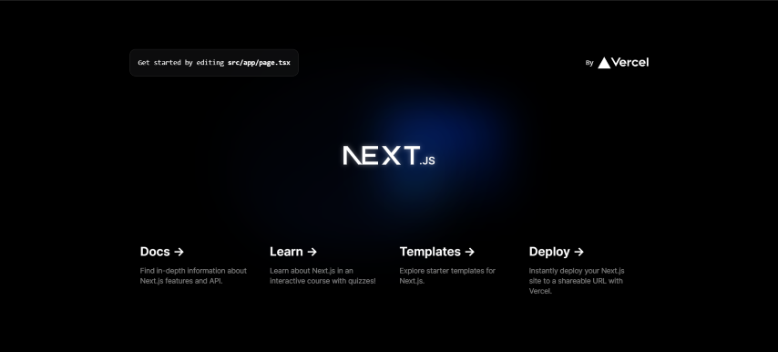

Authentication is very important in any application. In NextJs apps,
[NextAuth](https://next-auth.js.org/) is the go-to library for authentication.
But, NextAuth have limited support for Emali/Password authentication due to its
potential [security risks](https://next-auth.js.org/providers/credentials).
However, there are some use cases where you need to implement a simple Email
Password authentication in your NextJs app and don't want to use a third-party
service like Clerk or Auth0. In this tutorial, we will be building a simple
email password authentication system with Nextjs v14 (app router), Lucia, and
Drizzle.

### Project Setup

```bash
# bash
pnpm dlx create-next-app@latest
```

Select the options according to your requirements when prompted by the CLI. I've
selected the following-

```bash
√ What is your project named? ... next-lucia-auth
√ Would you like to use TypeScript? ... Yes
√ Would you like to use ESLint? ... Yes
√ Would you like to use Tailwind CSS? ... Yes
√ Would you like to use `src/` directory? ... Yes
√ Would you like to use App Router? (recommended) ... Yes
√ Would you like to customize the default import alias (@/*)?... No
```

```bash
# start dev server
cd next-lucia-auth
pnpm dev
```

open http://localhost:3000 in your browser. you should see the default nextjs
page.



We will not update the page for now. Stop the dev server with `ctrl + c` and
continue to the next step.

### database setup

We will be using MySQL database provided by
[planetscale](https://planetscale.com) in this project. Get your Database URL
from planetscale dashboard and add it to your `.env` file.

```
# .env
DATABASE_URL=YOUR_MYSQL_URL_HERE?ssl={"rejectUnauthorized":true}
```

Then, install the following dependencies.

```bash
pnpm add drizzle-orm @planetscale/database
pnpm add -D drizzle-kit dotenv-cli
```

After installation, create `src/db/schema.ts` file and put the database schema.
You can add more user table columns according to your requirements.

```ts
// src/db/schema.ts
import {
  mysqlTable,
  bigint,
  boolean,
  timestamp,
  varchar,
} from "drizzle-orm/mysql-core";

export const users = mysqlTable("user", {
  id: varchar("id", { length: 15 }).primaryKey(),
  email: varchar("email", { length: 255 }).unique().notNull(),
  createdAt: timestamp("created_at").defaultNow().notNull(),
  updatedAt: timestamp("updated_at").onUpdateNow(),
});

export type User = typeof users.$inferSelect;
export type NewUser = typeof users.$inferInsert;

export const key = mysqlTable("user_key", {
  id: varchar("id", { length: 255 }).primaryKey(),
  userId: varchar("user_id", { length: 15 }).notNull(),
  hashedPassword: varchar("hashed_password", { length: 255 }),
});

export const session = mysqlTable("user_session", {
  id: varchar("id", { length: 128 }).primaryKey(),
  userId: varchar("user_id", { length: 15 }).notNull(),
  activeExpires: bigint("active_expires", { mode: "number" }).notNull(),
  idleExpires: bigint("idle_expires", { mode: "number" }).notNull(),
  createdAt: timestamp("created_at").defaultNow().notNull(),
});
```

Then, create a file in `src/db/index.ts` and add the following code:

```ts
// src/db/index.ts
import { drizzle } from "drizzle-orm/better-sqlite3";
import Database from "better-sqlite3";

const sqlite = new Database("sqlite.db");

export const db = drizzle(sqlite);
```

After that create `drizzle.config.ts` file in the root directory and add the
following code:

```ts
// drizzle.config.ts
import { type Config } from "drizzle-kit";

export default {
  schema: "./src/db/schema.ts",
  driver: "mysql2",
  dbCredentials: {
    uri: process.env.DATABASE_URL!,
  },
} satisfies Config;
```

Finally add the following script in your `package.json` file:

```json
"scripts": {
  // ... other scripts
  "db:push": "dotenv drizzle-kit push:mysql"
}
```

And then run `pnpm run db:push` to push the schema to your database. If you get
an error like
`Transforming const to the configured target environment ("es5") is not supported yet`
then in your `tsconfig.json` file change the `target` to `es2017` or newer and
run the script again.

### Authentication setup

Install lucia first:

```bash
pnpm add lucia @lucia-auth/adapter-mysql
```

Then, create `src/auth/lucia.ts` file and add the following code. Import
`"lucia/polyfill/node"` at the top of the file if your node version is below 20.

```ts
import { lucia } from "lucia";
import { nextjs_future } from "lucia/middleware";
import { planetscale } from "@lucia-auth/adapter-mysql";
import { connection } from "@/db";

// import "lucia/polyfill/node"

export const auth = lucia({
  env: process.env.NODE_ENV === "development" ? "DEV" : "PROD",
  adapter: planetscale(connection, {
    // table names from schema.ts
    user: "user",
    key: "user_key",
    session: "user_session",
  }),
  middleware: nextjs_future(),
  sessionCookie: { expires: false },
  getUserAttributes: (data) => ({
    email: data.email,
  }),
});

export type Auth = typeof auth;
```

Create `src/app.d.ts` file and add the following code:

```ts
// app.d.ts

/// <reference types="lucia" />
declare namespace Lucia {
  type Auth = import("./auth/lucia").Auth;
  type DatabaseUserAttributes = {
    email: string;
  };
  type DatabaseSessionAttributes = {};
}
```

With that we have completed the drizzle and lucia setup. In the next part, we
will be creating the registration and login pages.

### Next Steps

- [Part 2: User Registration, Login and Logout](/posts/nextjs-email-password-auth-lucia-drizzle-2)
