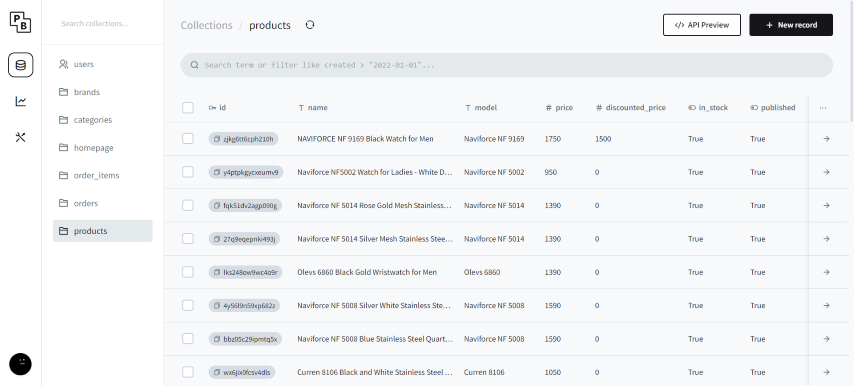
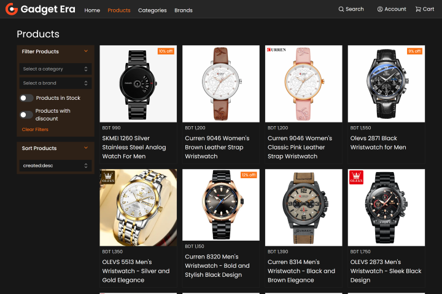
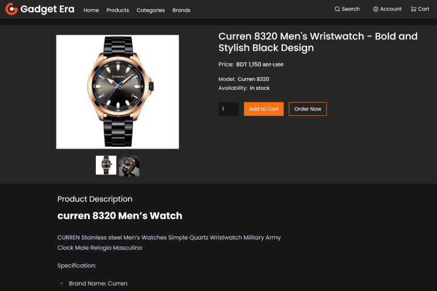
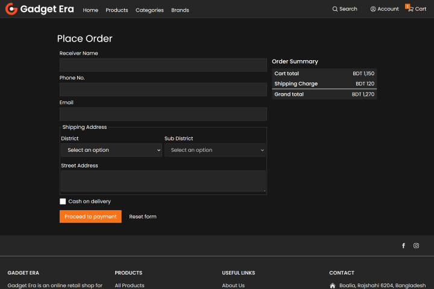

### About

Gadget Era is a full stack ecommerce website built with Nextjs and Pocketbase.
It is a fully functional ecommerce website with features like product filtering,
sorting, pagination, cart, checkout, order tracking, user profile, admin
dashboard, etc.

### Features

- Product filtering, sorting, pagination
- Cart, checkout, order tracking
- User profile, admin dashboard
- Responsive design
- SEO friendly
- Admin dashboard
- Light and dark mode

### Tech Stack

- Nextjs
- Tailwind CSS
- React Query
- Pocketbase

### Links

- [Live Website](https://gadgeterabd.com)
- [Frontend Repo](https://github.com/touha98/gadget-era-next)

### Screenshots

#### Admin Dashboard

#### Products Page

#### Product Page

#### Place Order Page

