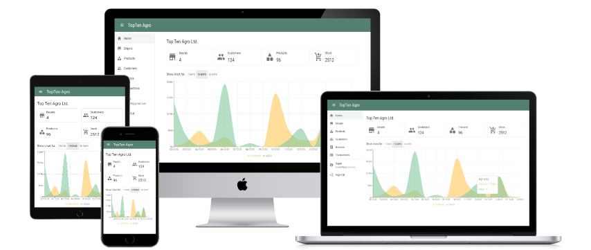
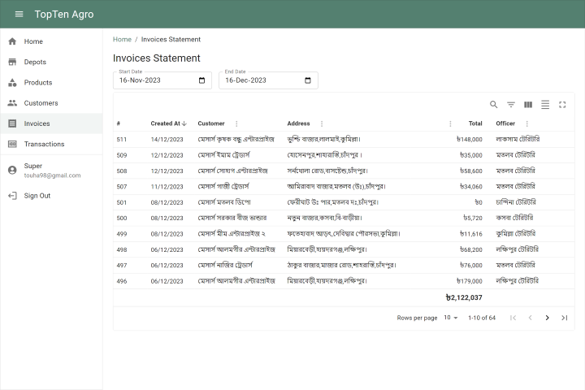
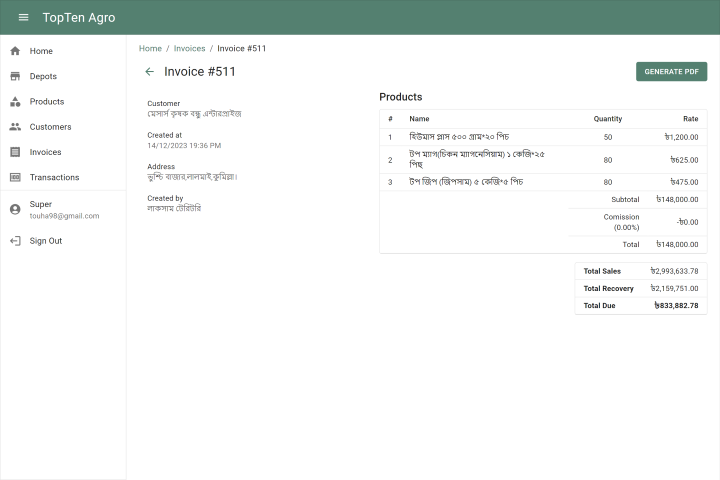
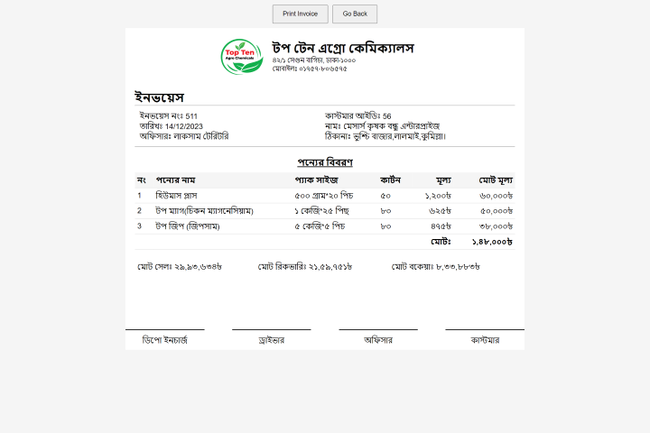

### About

Topten Agrovet is a web application built with Nextjs frontend and Django
backend for managing inventory and sales of a shop.

### Features

- Manage multiple warehouses and sales points
- Role based access control
- Manage inventories, customers, sales, transactions, suppliers and employees
- Generate reports and statements for time periods
- Print Invoice

### Tech Stack

- Nextjs
- Material UI
- Tanstack Table, Tanstack Query, React Hook Form and Zod
- Django
- Django Rest Framework
- PostgreSQL

### Links

- [Live](https://toptenagro.vercel.app)
- [Frontend Repo](https://github.com/top-ten-agro/next-client)
- [Backend Repo](https://github.com/top-ten-agro/django-server)

### Screenshots

